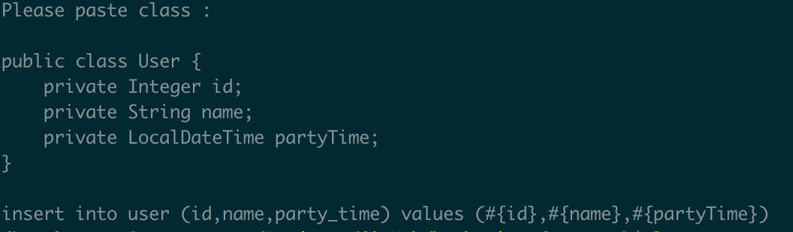
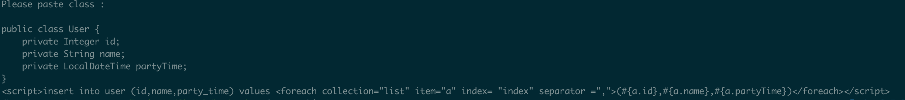

# barbarian

some utils by python

- 生成sql语句

  - ./sql_insert.py
    转换JavaBean至mybatis的insert语句

    

  - ./sql_insert_all.py
    转换JavaBean至mybatis的insertAll语句

    

  - ./sql_select.py

    转换JavaBean至select all语句

    

- 字符串操作

  - ./str_camel_2_snake.py

    字符串驼峰转下划线

    

  - ./str_snake_2_camel.py

    字符串下划线换驼峰

    