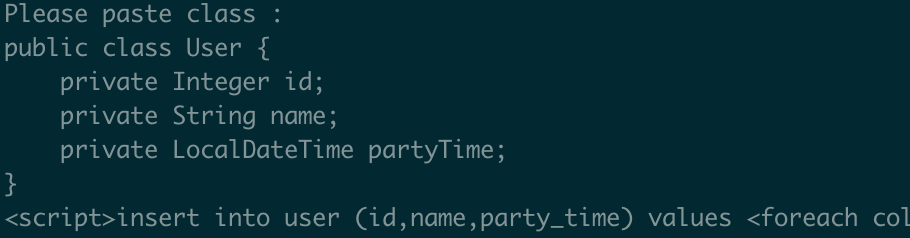
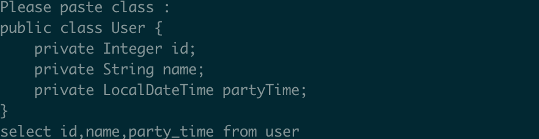

# barbarian

some utils by python

Table of Contents
=================

* [barbarian](#barbarian)
  * [生成sql语句](#%E7%94%9F%E6%88%90sql%E8%AF%AD%E5%8F%A5)
    * [\./sql\_insert\.py](#sql_insertpy)
    * [\./sql\_insert\_all\.py](#sql_insert_allpy)
    * [\./sql\_select\.py](#sql_selectpy)
  * [字符串操作](#%E5%AD%97%E7%AC%A6%E4%B8%B2%E6%93%8D%E4%BD%9C)
    * [\./str\_camel\_2\_snake\.py](#str_camel_2_snakepy)
    * [\./str\_snake\_2\_camel\.py](#str_snake_2_camelpy)
  * [随机操作](#%E9%9A%8F%E6%9C%BA%E6%93%8D%E4%BD%9C)
    * [\./random\_str\.py](#random_strpy)

## 生成sql语句

### ./sql_insert.py

转换JavaBean至mybatis的insert语句

### ./sql_insert_all.py

转换JavaBean至mybatis的insertAll语句

### ./sql_select.py

转换JavaBean至select all语句

## 字符串操作

### ./str_camel_2_snake.py

字符串驼峰转下划线

### ./str_snake_2_camel.py

字符串下划线换驼峰

## 随机操作

### ./random_str.py

生成随机字符串

